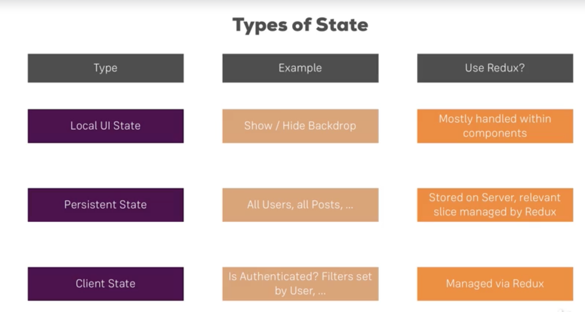

#### Basics of Redux in React application

- Redux is a node module `npm install --save redux`

- Redux is used for managing state. 

- Redux is independent of react application.

- To connect redux to react, there is separate package `npm install --save react-redux`.

- Redux is like a giant global object (or central store) which can be accessed from any part of the application.

- Redux workflow:
    - Component that wants to manipulate state dispatches `Action with payload` that reaches `Reducers`. 
    - Reducers updates the state (or central store)
    - Upon state update, store triggers `subscription` message. All the listening components receives new state as props.

- See files:
    - redux-basics.js -> basics of redux in this file
    - src/store/*
    - index.js

